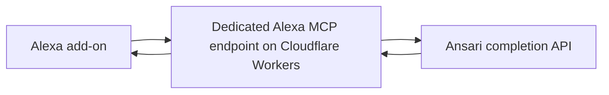

# Ansari for Alexa+: voice behavior, MCP transport, and hosting options

20 September 2026

[PR #3](https://github.com/ansari-project/ansari-mcp/pull/3) adds a short-answer voice profile to Ansari’s MCP server. The implementation is available for review and has been tested in an Alexa development simulator through a temporary Cloudflare Tunnel. It has not been merged or deployed to Ansari’s public service. A separately hosted Cloudflare endpoint and account linking are options for the next stage, not delivered features.

This specification describes implementation commit [`d6bd881`](https://github.com/ansari-project/ansari-mcp/commit/d6bd8813bb032d926d5ae173f133ca05425fe2fb), compared with upstream commit [`6def196`](https://github.com/ansari-project/ansari-mcp/commit/6def196f8e3efa5987780412791eb3acd32abde4). The decisions for Dr. Waleed Kadous and the Ansari maintainers are whether the shared server should adopt the protocol changes, where the Alexa-specific behavior should run, and whether Alexa access should require an Ansari account.

## Why the voice profile exists

Ansari’s normal answer style can be too long for a quick spoken exchange. Earlier experiments also showed live answers arriving after the Alexa interaction had already failed. However, Alexa completed narration of a previously retrieved answer of roughly 400 words. The limitation observed was therefore the time spent waiting for an answer, not an inability to narrate a long passage.

The implementation asks Ansari to generate a short answer before returning it to Alexa. The 100-word ceiling and eight-second provider deadline are engineering choices for this experiment, not documented universal Alexa limits. Shorter output can reduce generation time, but retrieval and provider load can still cause a timeout. The tests do not isolate how much of the improvement came from prompting rather than other differences between runs.

Ansari remains responsible for the answer’s substance. The adapter does not introduce another model, scrape the web experience, or generate speech itself. Alexa receives text and decides how to present and speak it.

## How a request completes

The Next.js application now exposes two routes. `/mcp` selects the standard profile; `/mcp/alexa` selects the voice profile. Both expose the existing tool, `answer_islamic_question`, with a `question` string. The caller cannot disable the voice restrictions by adding a parameter. The standalone FastMCP server selects the same voice behavior with `--alexa`.

For “What does gratitude mean in Islam?”, the request follows this path:

1. Alexa calls the voice endpoint with a self-contained question. The HTTP wrapper checks the browser origin when one is supplied, and the MCP SDK parses the request and validates the tool input.
2. The shared tool calls Ansari’s completion API. Voice mode sends the original question followed by a fixed instruction requesting a complete, plain-language answer of 40–70 words, never more than 90 words before the adapter adds attribution.
3. The service waits for the complete answer, subject to the eight-second total deadline. It normalizes either known fixed Ansari attribution footer and checks the final size.
4. The tool returns the accepted text with its attribution. Alexa may paraphrase that text and produces its own speech. If the service times out or the answer does not fit, the tool returns a short failure explanation instead.

The downstream service is the HTTP completion endpoint `/api/v2/mcp-complete`, not a second MCP conversation with `mcp.ansari.chat`. No change was made to the separate `ansari-backend` repository. Its published [completion handler](https://github.com/ansari-project/ansari-backend/blob/732b158f8424b297efe56e1d2d5f7aea04a21892/src/ansari/app/main_api.py#L959) accepts messages and returns generated text. The adapter uses that interface without assuming a supported token-budget parameter.

The experiment ran Next.js locally behind Cloudflare Tunnel. Cloudflare provided the public HTTPS route; it did not host the application. The checked-in default completion URL remains the staging URL. Live tests used the explicit production API override documented in [the setup guide](alexa.md).

## What replaced the custom handlers in `mcp.ts`

The old [`pages/api/mcp.ts`](https://github.com/ansari-project/ansari-mcp/blob/6def196f8e3efa5987780412791eb3acd32abde4/pages/api/mcp.ts) combined three responsibilities: implementing JSON-RPC/MCP, defining the Ansari tool, and managing HTTP requests and logs. Its method switch constructed protocol responses manually, including an initialization response fixed at `2024-11-05`.

The file is now a small route entry point calling `createMcpHandler('standard')`. This does not mean that all of its former behavior was preserved invisibly. Protocol dispatch moved to the SDK, Ansari-specific behavior moved into shared modules, and several previously exposed behaviors were removed or changed.

| Previous hosted-route behavior | Implementation in PR #3 | Reason and compatibility effect |
| --- | --- | --- |
| `initialize` always returned `2024-11-05` and advertised tools, resources, and prompts. | The SDK negotiates a supported revision. This route registers tools only. | Removes the fixed-version response and aligns advertised capabilities with registered functionality. Four revision handshakes were tested, including `2025-11-25`. |
| `tools/list` embedded a separately maintained JSON schema. | `answer-tool.ts` supplies the tool definition and Zod schema; the SDK serves discovery. | Keeps discovery and execution tied to one definition used by both Next.js and FastMCP. |
| `tools/call` manually extracted arguments and assembled results. | The SDK dispatches the registered tool; `answer-tool.ts` executes it. | Input validation and protocol framing use the SDK, while provider errors and answer policy remain application code. |
| `resources/list` and `prompts/list` returned empty arrays. | Neither capability is registered. Direct calls return JSON-RPC `-32601`, “Method not found.” | These empty-list handlers were removed, not transferred. Clients that call them without checking capabilities may need compatibility handlers restored. |
| `logging/setLevel` changed a module-level variable. | The hosted route no longer supports this method; it returns `-32601`. | Remote logging control was removed. Optional local metrics replace request-content debug logging, but are not an equivalent protocol feature. |
| Notifications were detected manually and acknowledged with HTTP 204. | The SDK accepts valid notifications with HTTP 202 and no JSON-RPC response body. | Follows the Streamable HTTP notification contract and removes custom request/notification classification. |
| GET returned a server-information JSON document. | GET returns HTTP 405. DELETE also returns 405; POST and OPTIONS are supported. | There is no standalone server-event stream or persistent session. Existing probes expecting GET `/mcp` to return 200 must change. |
| CORS reflected any supplied origin, and code set keep-alive headers directly. | The wrapper uses an explicit origin allowlist and leaves connection management to the runtime. | Browser clients outside the allowlist are rejected. This is an HTTP policy change, not authentication. |
| Debug logs included complete messages, parameters, and headers. | Those logs are removed; opt-in stderr metrics contain outcome, word count, duration, profile, and completion time. | Avoids logging questions, answers, and potential credentials in this MCP application. Ansari’s downstream logging policy is separate. |

The SDK is used in stateless **JSON-response mode**. Each HTTP request gets a server and transport instance, which are closed after handling the request. The application has no stored conversation to associate with a protocol session. “Streamable HTTP” names the MCP transport; it does not mean this implementation streams partial answer tokens to Alexa. The [transport specification](https://modelcontextprotocol.io/specification/2025-11-25/basic/transports) permits JSON responses and HTTP 405 when a GET event stream is not offered.

The choice reduces the protocol code Ansari must maintain as MCP evolves. It also avoids implementing the same tool separately in the hosted route and standalone server. FastMCP remains the standalone framework; the official SDK provides a request/response transport that fits Next.js API routes. The replacement does **not** establish that every historical client still works. Older version handshakes were tested over this transport; the obsolete HTTP+SSE transport was not added.

Restoring empty resource/prompt handlers or retaining a separate information endpoint would be feasible compatibility work. Those behaviors are not inherently incompatible with Alexa. Before merging the shared-route replacement, maintainers should decide whether existing clients rely on them. A separate Alexa endpoint offers a way to avoid imposing these changes on the general service.

## Voice policy and other implementation changes

The voice profile trims the question, rejects empty input, and limits it to 4,000 characters. It asks for short sentences, no presentation markup, essential qualifications and uncertainty, and at most one short source reference when relevant. These are generation instructions; the model is not guaranteed to follow every stylistic or content-quality request.

The adapter enforces a separate output boundary: an accepted answer must contain at most **100 whitespace-delimited words and 1,200 characters**, including attribution. The character limit bounds languages that do not separate words with spaces. Only the two known fixed API attribution footers are replaced, with “Source: Ansari, at ansari.chat.” The answer is otherwise preserved. An overlong answer is rejected rather than cut mid-sentence, because truncation could remove a qualification, citation, or condition from religious guidance.

Voice requests have an eight-second total provider deadline even if bytes continue arriving, and a 64 KiB response-size safeguard. There is no automatic retry. Timeout, oversized output, empty output, and provider failure become tool errors with brief explanations. Protocol failures remain distinct from application failures, consistent with the [MCP tool-error model](https://modelcontextprotocol.io/specification/2025-11-25/server/tools#error-handling).

The standard profile still forwards the original question without voice instructions or the voice answer cap. It is not completely unchanged: upstream failures now produce explicit tool errors instead of success-looking error strings, and the 30-second request limit now also has a total deadline. The shared schema rejects empty questions and extra arguments. Hosted behavior also changes wherever the preceding handler table says so.

Other changes support running and checking both entry points:

- `tsconfig.mcp.json` enables emitted JavaScript for the standalone server. Previously, `build:mcp` inherited `noEmit` from the Next.js configuration.
- Next.js resolves the shared modules’ `.js` imports back to TypeScript during its build; the emitted standalone modules retain valid Node imports.
- FastMCP remains on major version 3, Next.js on major version 15, and the MCP SDK is an explicit dependency at version 1.30 or later within major 1. Compatible lockfile fixes were applied. The recorded dependency audit still has eight advisories; the PR is not a claim of a clean security audit.
- The standalone HTTP configuration binds to loopback, allows a configurable port, and uses stateless JSON responses. Previous per-question progress and content logging were removed. The Node requirement is now 20.19 or newer.

These changes are confined to Ansari’s TypeScript, Next.js, FastMCP, Axios, and Zod implementation. No Hapi or Headspace code is part of the contribution.

## What the tests establish

Ten automated tests passed, along with type checking, the Next.js production build, and the standalone build. They cover profile separation, bounded output, footer handling, provider failures, the deadline during a continuously streaming response, MCP discovery and calls, notification handling, browser origins, version headers, and FastMCP stdio. FastMCP HTTP discovery also passed a smoke check.

The two Alexa simulator conversations produced the following results through Cloudflare:

| Request | Ansari result | Alexa response | Time until speech began |
| --- | --- | --- | --- |
| Explain gratitude in Islam. | 70 words in 3.08 seconds. | 53-word paraphrase with attribution; all three speech segments completed. | 9.00 seconds. |
| Explain tawheed in one thousand words. | 72 words in 2.485 seconds. | 68 words, including an explanation of the short voice format; all three segments completed. | 7.948 seconds. |

These observations establish basic endpoint invocation and simulator speech completion. They do not establish a latency guarantee, a theological quality assessment, audible output on a physical Echo, or faithful word-for-word narration. The output cap applies to the tool result; Alexa controls its own final speech. [The validation notes](alexa.md#validation-on-2026-09-20) retain the test details.

## Alternative: a dedicated Cloudflare endpoint donated by Machine Wisdom

Machine Wisdom could donate hosting for a separate Alexa MCP endpoint on Cloudflare Workers. This is an alternative for agreement with Dr. Waleed Kadous, not an already provisioned service or an agreed support commitment. Its request path would be:

The Worker would own Alexa’s tool descriptions, answer budget, timeouts, protocol compatibility, and any future account-linking enforcement. Ansari would continue to own answer generation, source retrieval, and the completion API. The general Ansari MCP endpoint could evolve independently for desktop and other clients. Calling the completion API directly would avoid making Alexa depend on the general MCP endpoint’s response style or protocol revision.

This would be a separate deployment boundary, not necessarily a separate repository or a permanent fork. Ansari could retain the source under its organization while Machine Wisdom operates the donated deployment. The current request/response policy could be reused, but the Next.js HTTP wrapper would need a Worker-compatible transport and a fresh deployment test. Cloudflare [supports remote MCP over Streamable HTTP](https://developers.cloudflare.com/agents/model-context-protocol/protocol/transport/). The implementation would need to preserve the `2025-11-25` behavior already tested with Alexa rather than assume a newer protocol revision is compatible.

| Decision | Shared Ansari deployment in PR #3 | Dedicated Cloudflare deployment |
| --- | --- | --- |
| General MCP clients | Share the changed HTTP handler; compatibility review is needed. | Keep their existing endpoint and behavior. |
| Alexa-specific evolution | Shares a release and operational boundary with the general server. | Can change voice policy, protocol settings, and authentication independently. |
| Hosting | Ansari adopts the additional route in its hosting environment. | Machine Wisdom donates the proposed Cloudflare hosting, on agreed terms. |
| Maintenance | One application and dependency set. | An additional deployment and API dependency; shared policy code reduces duplication. |
| Effect on PR #3 | Review and merge the combined changes. | Split generally useful protocol/build repairs from Alexa-only work, and reconsider shared-route removals. |

A dedicated endpoint would remove the experiment’s dependency on a running laptop. It would not make Ansari’s model faster or eliminate provider timeouts. The donation needs an agreed domain and account owner, operating and cost limits, access to deploy and recover the service, handling of logs, and a transfer or shutdown arrangement. Hosting the adapter also does not pay for unlimited inference or authorize unrestricted traffic against Ansari’s API.

The separate deployment is attractive if Ansari wants to preserve its existing MCP behavior while the Alexa experience develops. The current shared implementation is simpler if the maintainers want both profiles in one service and accept the compatibility changes. No choice between these alternatives has been approved by this specification.

## Next step: decide access policy, then add account linking

The current experiment accepts requests without user login, matching the existing completion API’s documented public-access behavior. This was not introduced by bypassing the web login. The web application has a signed-in experience, but its published [login screen also contains a guest path](https://github.com/ansari-project/ansari-frontend/blob/528698b3a87b1cef614c927be85ec1f2df93fa1c/src/app/%28public%29/login.tsx#L166). That source does not establish which guest features are enabled in today’s deployment. The decision is whether Alexa should require a recognized Ansari user, rather than assuming either that web login is universally mandatory or that public MCP access is approved for the add-on.

If account linking is selected, the MCP endpoint becomes a protected resource. It needs public metadata at `/.well-known/oauth-protected-resource` identifying its canonical endpoint, supported scopes, and authorization server. That document points to an OAuth server such as Auth0. Separately, Auth0 hosts its OpenID Connect (OIDC) discovery document at `/.well-known/openid-configuration`, describing the issuer and its endpoints; OAuth authorization-server metadata is another supported discovery mechanism. The two documents serve different roles, and a static OIDC document alone does not implement login. See [MCP authorization discovery](https://modelcontextprotocol.io/specification/2025-11-25/basic/authorization#authorization-server-discovery) and [Auth0 discovery](https://auth0.com/docs/get-started/applications/configure-applications-with-oidc-discovery).

The proposed linking flow would use authorization codes with PKCE S256, registered Alexa redirect URLs, and refresh-token support. The MCP endpoint would validate each access token’s signature, issuer, intended audience, expiry, and required permissions before invoking Ansari. Missing or invalid credentials would receive HTTP 401 with the appropriate authentication challenge. This is distinct from an HTTP-200 MCP tool error for a slow answer. [Auth0’s authorization-code flow](https://auth0.com/docs/get-started/authentication-and-authorization-flow/authorization-code-flow-with-pkce) supplies the login and token exchange; it does not supply the application’s access policy.

An Auth0 login must also map to the intended Ansari account if the purpose is account continuity. Placing Auth0 in front of the currently public completion API would gate the Alexa endpoint, but would not automatically give Ansari a verified user identity, expose that user’s history, or protect the general public API. The identity relationship and any downstream API changes therefore need Ansari’s agreement.

**The next implementation step is account linking, including the MCP `.well-known` resource document and an OAuth/OIDC provider such as Auth0, unless Dr. Waleed Kadous explicitly approves making the Alexa-facing Ansari MCP available without login rather than requiring the account used for the signed-in experience at ansari.chat.**
